<pre  style="line-height: 1; font-family: monospace;align="center"">
                          ███╗   ███╗ █████╗ ██╗  ██╗██╗███╗   ███╗ ██████╗ ███████╗███████╗       
                          ████╗ ████║██╔══██╗╚██╗██╔╝██║████╗ ████║██╔═══██╗██╔════╝██╔════╝       
                          ██╔████╔██║███████║ ╚███╔╝ ██║██╔████╔██║██║   ██║█████╗  █████╗         
                          ██║╚██╔╝██║██╔══██║ ██╔██╗ ██║██║╚██╔╝██║██║   ██║██╔══╝  ██╔══╝         
                          ██║ ╚═╝ ██║██║  ██║██╔╝ ██╗██║██║ ╚═╝ ██║╚██████╔╝██║     ██║            
                          ╚═╝     ╚═╝╚═╝  ╚═╝╚═╝  ╚═╝╚═╝╚═╝     ╚═╝ ╚═════╝ ╚═╝     ╚═╝
</pre>

<h1 align="center">👋 Hi! I'm Pietro Osores</h1>

  <strong>Junior Software Developer</strong> — I build fast, clear, and reliable web products with <strong>TypeScript</strong>, <strong>React</strong>, <strong>Node.js</strong>, and <strong>Python</strong>.

  
  
  
  
  

---

## 🧑‍💻 About Me

- 🚀 I turn ideas into **clear, fast, and reliable digital products** that solve real problems and feel simple from the first interaction.
- 🔄 I work **end to end**, translating needs into polished interfaces, solid logic, and experiences that keep people at the center.
- 🤖 I apply **AI to software development** through SDD (Spec-Driven Development), agent harnesses, and AI-assisted methodologies to plan, build, and validate software.
- 📚 I **learn quickly**, care about the details, and take ownership of every delivery.
- 🎯 I'm looking for a team where I can **contribute from day one** and grow by building work with real impact.

## 🛠️ Technologies & Tools

  

---

## 💼 Experience

### 🏛️ [goberna.club](https://goberna.club/) — Development Contribution
Contributed to the platform using **TypeScript**, **React**, **NestJS**, and **Python**.

   

---

## 📫 Contact

If you'd like to talk about development, projects, or a job opportunity, reach out!

- 🌐 **Portfolio:** [pietro.engineer](https://www.pietro.engineer/)
- 📧 **Email:** [contactame@pietro.engineer](mailto:contactame@pietro.engineer)
- 💼 **LinkedIn:** [Pietro Osores Marchese](https://www.linkedin.com/in/pietro-osores-marchese-7aa182192/)
- 🐙 **GitHub:** [@Maximoff19](https://github.com/Maximoff19)

---

  Made with ❤️ and ☕ in Peru

